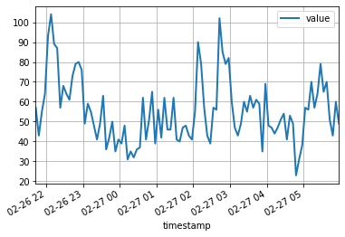
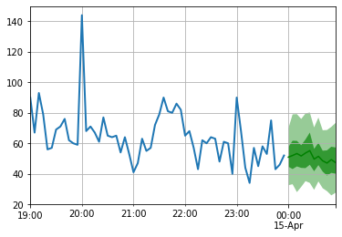

# PyTorch-TS

PyTorch-TS is a PyTorch Probabilistic Time Series Modeling framework which provides state of the art time series models and utilities for loading and iterating over time series data sets.

## Installation

```
$ pip3 install pytorchts
```

## Quick start

```python
import matplotlib.pyplot as plt

import pandas as pd

from pts.dataset import ListDataset
```


```python
from pts.model.deepar import DeepAREstimator
from pts import Trainer
from pts.dataset import to_pandas
```

This simple example illustrates how to train a model on some data, and then use it to make predictions. As a first step, we need to collect some data: in this example we will use the volume of tweets mentioning the AMZN ticker symbol.


```python
url = "https://raw.githubusercontent.com/numenta/NAB/master/data/realTweets/Twitter_volume_AMZN.csv"
df = pd.read_csv(url, header=0, index_col=0, parse_dates=True)
```

The first 100 data points look like follows:


```python
df[:100].plot(linewidth=2)
plt.grid(which='both')
plt.show()
```




We can now prepare a training dataset for our model to train on. Datasets are essentially iterable collections of dictionaries: each dictionary represents a time series with possibly associated features. For this example, we only have one entry, specified by the `"start"` field which is the timestamp of the first data point, and the `"target"` field containing time series data. For training, we will use data up to midnight on April 5th, 2015.


```python
training_data = ListDataset(
    [{"start": df.index[0], "target": df.value[:"2015-04-05 00:00:00"]}],
    freq = "5min"
)
```

A forecasting model is a *predictor* object. One way of obtaining predictors is by training a correspondent estimator. Instantiating an estimator requires specifying the frequency of the time series that it will handle, as well as the number of time steps to predict. In our example we're using 5 minutes data, so `req="5min"`, and we will train a model to predict the next hour, so `prediction_length=12`. The input to the model will be a vector of size `input_size=43` at each time point.  We also specify some minimal training options.


```python
estimator = DeepAREstimator(freq="5min",
                            prediction_length=12,
                            input_size=43,
                            trainer=Trainer(epochs=10))
predictor = estimator.train(training_data=training_data)
```
```
    47it [00:02, 16.03it/s, avg_epoch_loss=4.69, epoch=0]
    48it [00:03, 15.55it/s, avg_epoch_loss=4.22, epoch=1]
    47it [00:02, 16.87it/s, avg_epoch_loss=4.13, epoch=2]
    49it [00:03, 15.99it/s, avg_epoch_loss=4.08, epoch=3]
    49it [00:02, 17.39it/s, avg_epoch_loss=4.04, epoch=4]
    49it [00:03, 16.07it/s, avg_epoch_loss=4.01, epoch=5]
    48it [00:03, 15.63it/s, avg_epoch_loss=4.00, epoch=6]   
    47it [00:02, 15.81it/s, avg_epoch_loss=3.99, epoch=7]
    49it [00:03, 15.84it/s, avg_epoch_loss=3.98, epoch=8]
    49it [00:02, 18.14it/s, avg_epoch_loss=3.97, epoch=9]
```

During training, useful information about the progress will be displayed. To get a full overview of the available options, please refer to the source code of `DeepAREstimator` (or other estimators) and `Trainer`.

We're now ready to make predictions: we will forecast the hour following the midnight on April 15th, 2015.


```python
test_data = ListDataset(
    [{"start": df.index[0], "target": df.value[:"2015-04-15 00:00:00"]}],
    freq = "5min"
)
```


```python
for test_entry, forecast in zip(test_data, predictor.predict(test_data)):
    to_pandas(test_entry)[-60:].plot(linewidth=2)
    forecast.plot(color='g', prediction_intervals=[50.0, 90.0])
plt.grid(which='both')
```




Note that the forecast is displayed in terms of a probability distribution: the shaded areas represent the 50% and 90% prediction intervals, respectively, centered around the median (dark green line).


## Development

```
pip install -e .
pytest test
```
